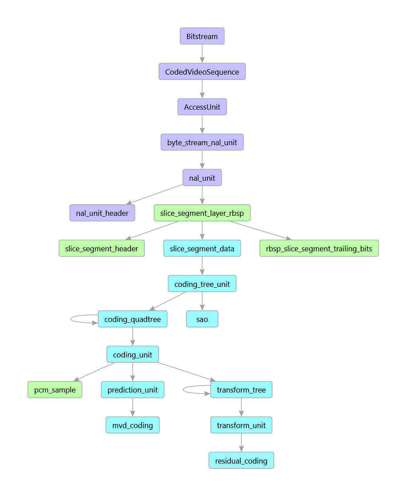

# Introduction

The Turing Codec is architected with the following aims in mind:
* Nothing about the architecture should restrict potential performance
* As much as possible code should be reused between encoding, decoding and other functionality
* It is desireable to have clear segregation between syntax, semantics, behaviour and state
* It should be possible for dependent projects to extend the codec in terms of functionality and performance 

# Language

The project uses C++14 as supported by GCC 5 and Visual Studio 2015.

Template metafunctions and static polymorphism are used to enable generic code within the project. These techniques reduce duplication of functionality while allowing highly specialised object code to run fast with minimal run-time branches or the need for virtual functions.


# Concepts
C++ "concepts" were not adopted for C++14 but they are nevertheless a valuable idiom for design and documentation. The concepts described here are frequently used throughout the code as C++ template parameters.

## Function
A Function is a type representing a syntax function and is passed to the one-argument Handler operator(). Function types are usually POD types containing the syntax function arguments as data members. For example:

```
struct coding_unit
{
    coding_unit(int x0, int y0, int log2CbSize);
    int x0;
    int y0;
    int log2CbSize;
};
```

## Value
Types of the Value concept identify the semantic meaning of a syntactic element, derived value or other element of data. A Value object contains just enough static and dynamic data to identify it and know how to handle it.
A Value object is used as parameter to `Handler::operator[]` to access the wanted state data. It also may be used as the first parameter when invoking a syntax element using the two-argument `Handler::operator()`.

Value types are usually POD or empty classes. Examples:

```
// Here, value type is enough to identified the wanted data. 
struct transquant_bypass_enabled_flag {};

// POD struct using members to convey values of indices.
struct cu_skip_flag
{
	int x0;
	int y0;
}; 
```

## Mnemonic
A Mnemonic specifies the way a Value is represented in the bitstream. Mnemonic types are often POD or empty classes. Examples: 

```
struct u
{
	u(int n);
	int n;
};
```

## Handler
The Handler concept represents an object providing access to all state and all child functions. Classes conforming to the State concept have attributes as illustrated below.

```
struct Handler
{
	// State data and element value accessor
	template <class V>
	Value<V>::Type operator[](V);

	// Mechanism for invocation of child elements
	template <class V, class M>
	void State::operator()(V, M);

	// Mechanism for invocation of child functions
	template <class F>
	void State::operator()(F);
    
    // Convenient access to a structure somewhere within the state
	template <class S>
	operator S *();
};
```

The operators above are used extensively in the project and dominate the style of the code. They permit generic code that is independent of the way state is maintained. 

In practice Handler is typically a tuple of pointers to state structures together with some type information that controls behaviour.

## Verb
An Verb is a template describing the action to be performed during syntax tree traversal. An Verb may be valid for the entire syntax tree or may only ever be used on part of the syntax. Verbs are templates with a single class parameter. Examples could include: 

```
// parse a bitstream without decoding it
template <class F> struct Read; 

// decode a bitstream to YUV
template <class F> struct Decode; 

// count the number of bitstream bits required
template <class F> struct CountBits. 
```

A Verb often has associated state, e.g. ``CountBits<>`` would have a counter variable somewhere. 


## Example
A typical example usage of the Verb, Value, Mnenomic, Function and Handler concepts is shown in the snippet:

```
template <> struct Syntax<coding_unit>
{
	template <class H> static void go(coding_unit cu, H &h)
	{
		if (h[transquant_bypass_enabled_flag()])	
			h(cu_transquant_bypass_flag(), ae(v));
		if (h[slice_type()] != I)
			h(cu_skip_flag(cu.x0, cu.y0), ae(v));
		auto const nCbS = 1 << cu.log2CbSize;	
		if (h[cu_skip_flag(cu.x0, cu.y0)])	
			h(prediction_unit(cu.x0, cu.y0, nCbS, nCbS));
        ...
```
In this example, the Verb is `Syntax<>`. Object `cu` of type `coding_unit` is the Function and the Handler object `h` has a template type `H`. The implementation of child functions, syntax elements and state variables is completely dependent on Handler type `H`. This allows the same code to be deployed in a video encoder, decoder, parser, analyser, etc. by just using a different concrete type for `H`. 


# Syntax call graph
Video compression formats are hierarchical in structure and in conventional software codec implementations, code execution walks a tree based on this hierarchical structure. 

Shown below is the syntax function call tree of HEVC. Strictly speaking the first three are not "syntax functions" but the codec uses them as shown.



There are two important things to note about the project's source code:
1. Each of the nodes in the above graph is represented by a type conforming to the Function concept. Where a node represents a syntax function described in the standard, the Function type is a simple aggregation of the syntax function arguments. 
2. When execution flows from a syntax function to a child element, the child is not invoked by a direct function call.  The call is instead passed via a Handler object. This gives implementations the opportunity to perform specific behaviour before and after the call, or to suppress that child call entirely. 

The second point above is key to the design of the software framework. The same generic code is reused for different purposes by templating it appropriately.

In the current design, calls to child syntax functions are passed via a Handler's `operator()` to a specific `Verb<>::go()`. This function is statically polymorphic depending on the Verb in a manner somewhat similar to the "static visitor" design pattern.


# State
Codec state is complex and multifaceted. A typical HEVC encoder or decoder state comprises things such as:
-	parameter set values
-	bitstream data and current stream position
-	CABAC range/value state,
-	CABAC context variables
-	DPB
-	current input/output picture and anything implementation specific
-	encoder rate control
-	configuration data

State may be correspond to an entire video sequence, a single picture, a thread of execution  or exist locally for a picture region.

## State aggregation
To facilitate the syntax function calling syntax using a Handler's `operator()` described above, all state must be accessible via a single Handler object. Further aggregation may take place as execution passes deeper into the syntax function call tree adding more state, or modifying the way state is handled.

## State access
State access is via a Handler object.

The Handler's `operator[]` function provides convenient access for getting and setting variables and retrieving derived values. This function makes use of `struct Access<>` to provide full compile-time control over how state is arranged and managed. Different specialisations of `Access` allow values to be accessed as variables in some parts of the code and set to compile-time constants in other, optimised parts. 

If direct access to a structure within the state is required, this may be achieved via the Handler's `operator S *()`. For example, `StateWidget *stateWidget = h` will retrieve a pointer to a `StateWidget` from the aggregated structures pointed to by Handler `h`.

# Performance
## Runtime performance
Optimising C++ compilers inline multiple levels of call hierarchy and eliminate small classes such as typical Mnemonics, Functions and Values. Testing shows no performance downside to this approach when compared against a conventional, shallow function hierarchy. 

The architecture offers the option to implement parts of the syntactic tree in a different way. HEVC’s residual_coding may benefit from this treatment.

## Compilation speed
Template metafunctions and static polymorphism are used extensively in the code for reasons of extensibility, flexibility, syntactic sweetness and runtime performance. A significant downside to their usage can be a greatly extended compilation time. This is mitigated by apportioning code between compilation units (i.e. .cpp files) such that code can be built in parallel.

